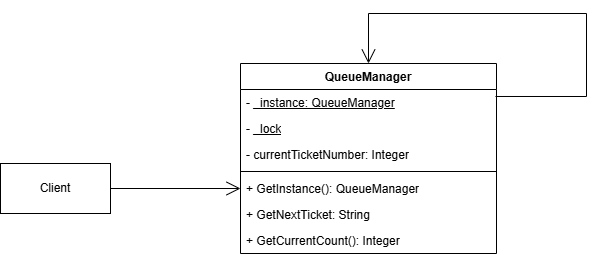

# Лабораторная работа №1

## Предметная область
   >Паттерн «Одиночка» — это порождающий паттерн проектирования, который гарантирует, что у класса есть только один экземпляр, и предоставляет к нему глобальную точку доступа.

**Электронная очередь** – если бы у каждого регистратора была своя собственная независимая база номеров талонов — возникла бы путаница.
## Описание проблемы
   Главные проблемы которые паттерн «одиночка» решает в моей предметной области:
1. **Конфликты ресурсов:** Без «одиночки» два регистратора могут выдать талон на одно и то же время к одному врачу, если они используют разные объекты системы записи.

2. **Целостность данных:** Реестр пациентов должен быть единым источником истины. «Одиночка» предотвращает создание копий данных, которые могут начать рассинхронизироваться.

3. **Экономия памяти:** Вместо создания тяжелого объекта управления базой данных для каждого окна регистратуры, используется один общий объект.

4. **Глобальный доступ:** Любой модуль системы (запись, вызов врача на дом) может легко обратиться к текущему состоянию очереди.

## Решение проблемы
   >Использование паттерна «Одиночка».
1. **Поле _lock и оператор lock:** В методе GetInstance и потенциально в методе **используется блокировка**. Пока один поток (одно окно регистратуры) создает объект или меняет номер, остальные «ждут» своей очереди на доступ к ресурсу.
2.  **Гарантия единственности:** Поскольку _instance только один, у нас нет ситуации, когда у Окна №1 своя переменная _currentTicketNumber, а у Окна №2 — своя.
3. - Приватный конструктор private QueueManager(): Он **запрещает** создание объекта через new в любом месте программы.
   - ***Ленивая инициализация:*** Объект создается только один раз при первом обращении (if (_instance == null)). Все последующие вызовы просто отдают ссылку на уже существующий в памяти объект.
4. **Статическое свойство:** Метод GetInstance() является глобальной точкой доступа. Это гарантирует, что из любой части программы (модуль статистики, монитор в холле, компьютер регистратора) мы попадем в один и тот же участок памяти.
## Диаграмма классов

